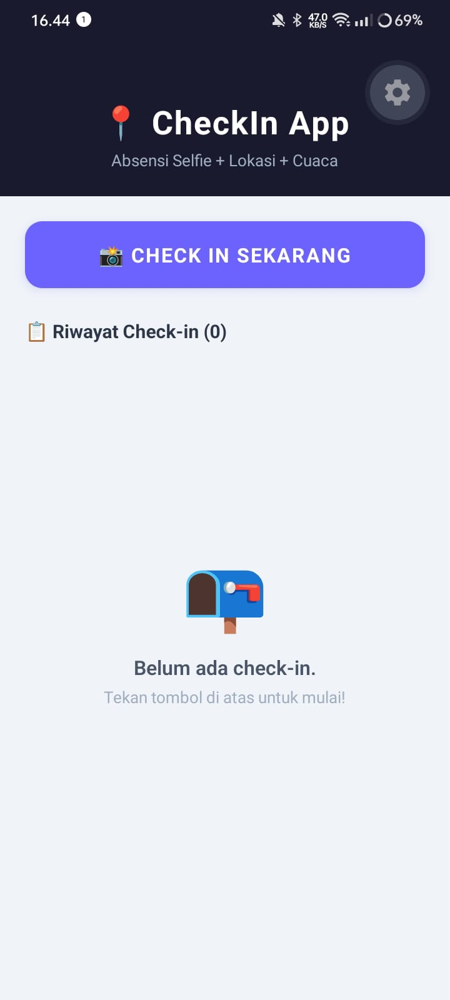
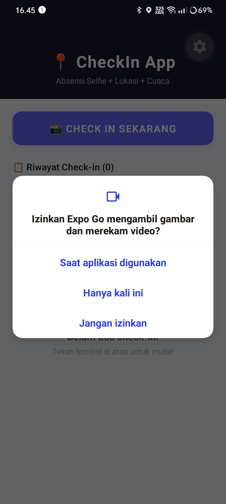
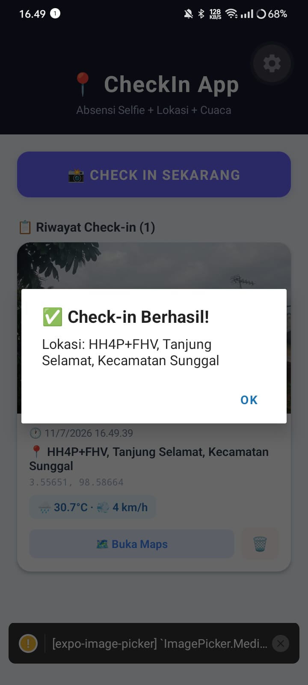
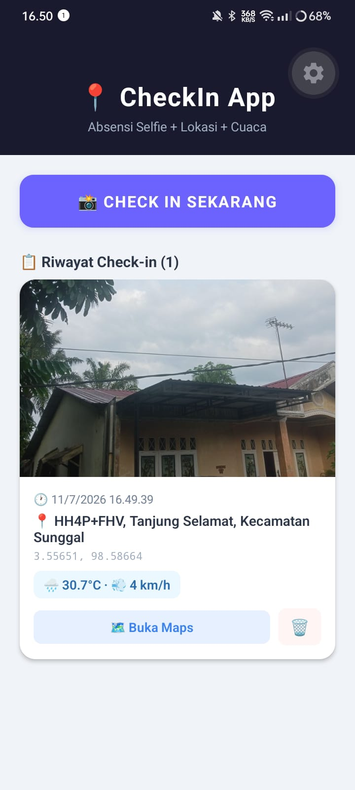
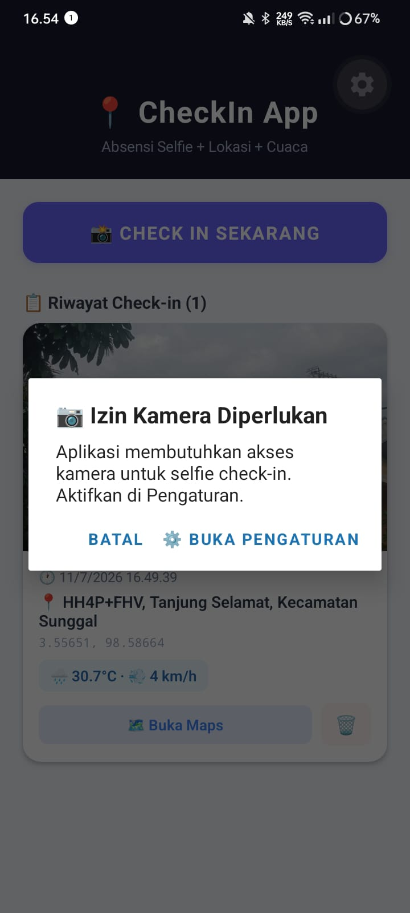
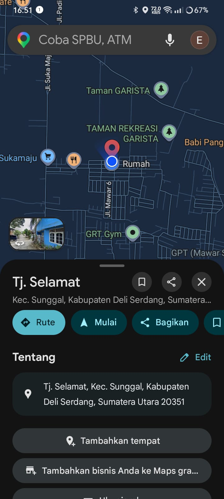

# 📍 CheckIn App

Aplikasi absensi berbasis **selfie + GPS + cuaca** yang dibangun dengan React Native & Expo.  
Pengguna dapat melakukan check-in dengan foto (dari kamera atau galeri), mencatat koordinat lokasi secara otomatis, mendapatkan nama tempat melalui reverse geocoding, serta melihat informasi cuaca saat ini.

---

## ✨ Fitur Aplikasi

### 🟢 Level 1 — Fitur Wajib (Core)
| Fitur | Keterangan |
|---|---|
| 📷 Akses Kamera | `expo-image-picker` dengan `launchCameraAsync` |
| 🖼️ Akses Galeri | `expo-image-picker` dengan `launchImageLibraryAsync` |
| 📍 GPS / Lokasi | `expo-location` dengan `getCurrentPositionAsync` |
| 🔐 Permission Flow | Request izin → cek `status === 'granted'` → akses fitur |
| 🚫 Graceful Rejection | Alert ramah + tombol buka Pengaturan jika izin ditolak |
| ✅ Cek `canceled` | `if (!result.canceled)` sebelum ambil `assets[0].uri` |
| 🗺️ Tampil Koordinat | Latitude & longitude ditampilkan di setiap kartu |

### 🟡 Level 2 — Fitur Pengembangan (4 dari 6)
| Fitur | ✅ | Keterangan |
|---|---|---|
| 📸 Kamera + Galeri | ✅ | Alert pilihan sumber: kamera atau galeri |
| 📍 Kamera + Lokasi | ✅ | Foto DAN koordinat GPS disimpan dalam satu entri check-in |
| 💾 Persistensi | ✅ | AsyncStorage — data tersimpan meski app ditutup/restart |
| 🗺️ Buka di Maps | ✅ | Tombol buka `maps.google.com/?q=lat,lng` via `Linking` |
| 🔁 Tombol Settings | ✅ | Saat izin ditolak, tersedia tombol `Linking.openSettings()` |

### 🔴 Level 3 — Bonus
| Fitur | ✅ | Keterangan |
|---|---|---|
| 🌤️ GPS + Cuaca | ✅ | Koordinat dikirim ke Open-Meteo API, tampilkan suhu & angin |
| 🗺️ Reverse Geocoding | ✅ | `Location.reverseGeocodeAsync` — koordinat → nama tempat |
| 📄 app.json Lengkap | ✅ | `NSCameraUsageDescription`, lokasi, galeri (iOS & Android) |
| 🗑️ Hapus Check-in | ✅ | Tombol hapus tiap entri + konfirmasi Alert |

---

## 📸 Screenshot

> _Screenshot diambil langsung dari HP fisik saat pengujian._

| Halaman Utama | Dialog Izin | Check-in Sukses |
|---|---|---|
|  |  |  |

| Hasil Check-in | Penolakan Izin | Buka Maps |
|---|---|---|
|  |  |  |

---

## 🚀 Cara Menjalankan

### Prasyarat
- Node.js >= 18
- Expo CLI: `npm install -g expo-cli`
- Expo Go di HP fisik ([Android](https://play.google.com/store/apps/details?id=host.exp.exponent) / [iOS](https://apps.apple.com/app/expo-go/id982107779))
- GPS HP harus aktif

### Langkah Instalasi

```bash
# 1. Clone repo
git clone https://github.com/eykelagitha/CheckInApp.git
cd CheckInApp

# 2. Install dependencies
npm install

# 3. Jalankan dev server
npx expo start

# 4. Scan QR code dengan Expo Go di HP fisik
```

---

## 🧪 Test Case

| No | Skenario | Ekspektasi |
|---|---|---|
| 1 | Tap "CHECK IN" → pilih Kamera → ambil selfie | Foto tampil di kartu, koordinat & cuaca muncul |
| 2 | Tap "CHECK IN" → pilih Galeri → pilih foto | Foto dari galeri berhasil digunakan untuk check-in |
| 3 | Tolak izin kamera | Alert ramah muncul + tombol "Buka Pengaturan" |
| 4 | Tolak izin lokasi | Alert ramah muncul + tombol "Buka Pengaturan" |
| 5 | Tap "🗺️ Buka Maps" | Google Maps terbuka di koordinat check-in |
| 6 | Tutup & buka app ulang | Semua riwayat check-in masih ada (AsyncStorage) |
| 7 | Tap 🗑️ → konfirmasi hapus | Entri terhapus dari list & AsyncStorage |

---

## 🛠️ Tech Stack

| Teknologi | Versi | Fungsi |
|---|---|---|
| React Native | 0.73.6 | Framework UI mobile |
| Expo SDK | ~56 | Runtime & tooling |
| expo-image-picker | ~14.7.1 | Akses kamera & galeri |
| expo-location | ~16.5.3 | GPS, izin lokasi, reverse geocoding |
| @react-native-async-storage/async-storage | 1.21.0 | Persistensi data lokal |
| Open-Meteo API | - | Data cuaca real-time (gratis, tanpa API key) |
| Linking (RN built-in) | - | Buka Google Maps & Pengaturan |

---

## 🔗 Links

- **Expo Snack:** [https://snack.expo.dev/@eykel21/6f241b](https://snack.expo.dev)
- **GitHub:** [https://github.com/eykelagitha/CheckInApp.git](https://github.com)

---

## 👤 Developer

**Nama:** Eykel Agitha Kembaren  
**NIM:** 243303621275  
**Program Studi:** Sistem Informasi — UNPRI  
**Mata Kuliah:** Praktikum Pemrograman Mobile (React Native) (Misi 13)
